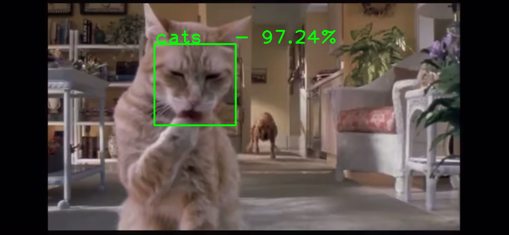
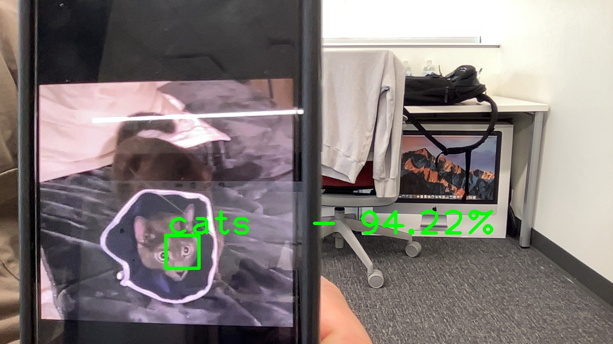

# FineTune and RealTime-Detector

It present a few simple yet effective methods that you can use to build a powerful image classifier, using only very few training examples --just a few hundred or thousand pictures from each class you want to be able to recognize. It also shows how the real-time image classification works.

## Main files

**`FineTune_and_Data_Augmentation.ipynb`** includes the main classifcation code. 

the outline will go as follows:
- collection data from the kaggle [cats_and_dogs](https://www.kaggle.com/c/dogs-vs-cats/data) and use only 2800 data points, where `2000` for training and validation and `800` for validation. we also use extra `400` for testing
- training a small network from scratch as a baseline
- apply the data augmentation
- using the bottleneck features of a pre-trained network
- fine-tuning the top layers of a pre-trained network

In this script, one could reduce the overfitting problem by using the aformentioned strategies, which is veryful when dealing with the insufficient data.

**`real_time_face_detector.ipynb`** shows some examples how to apply the trained model from **`FineTune_and_Data_Augmentation.ipynb`** to achieve rea-time image classification. 
- static capture the face from image
- object detction from the video
- real-time face detection

here is an example that load the video from movie `cats and dogs` and detect the objects shown in the video and classify it.

This is the real-time object detection on webcam image that distinguish my cat

